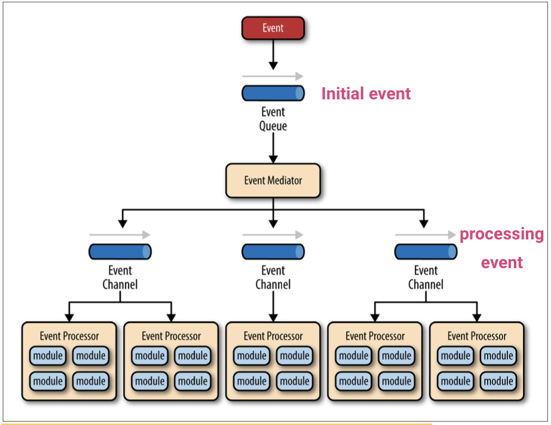
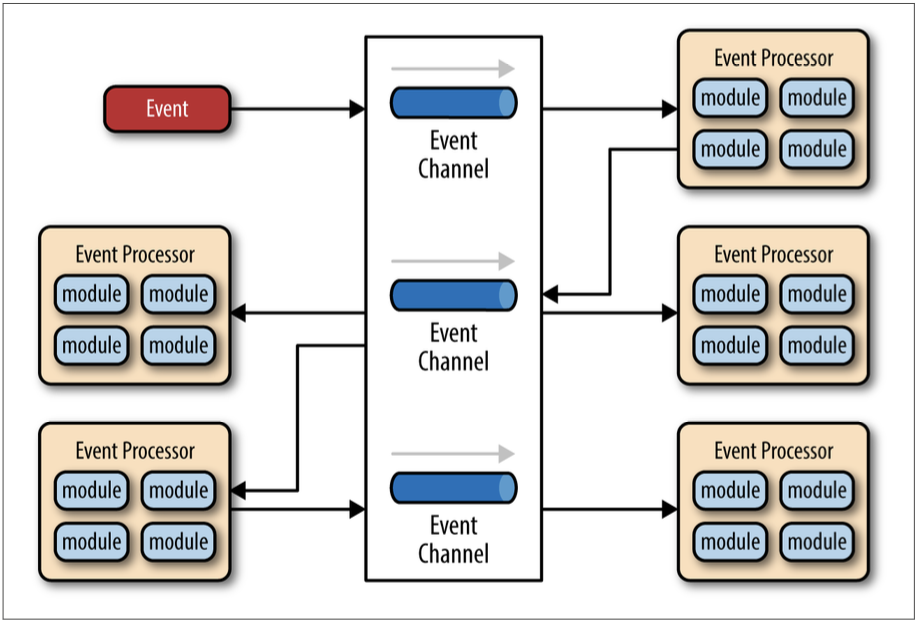
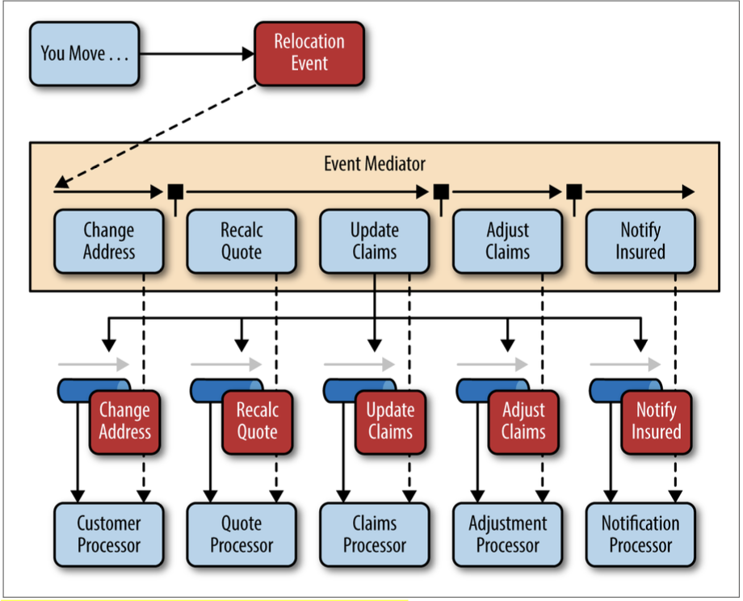
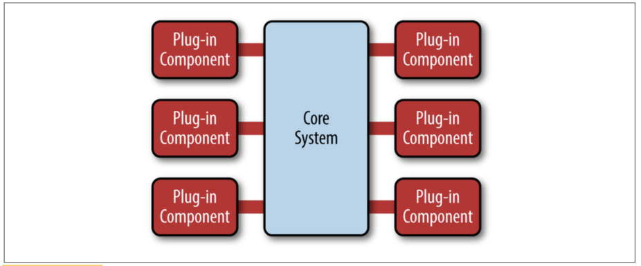
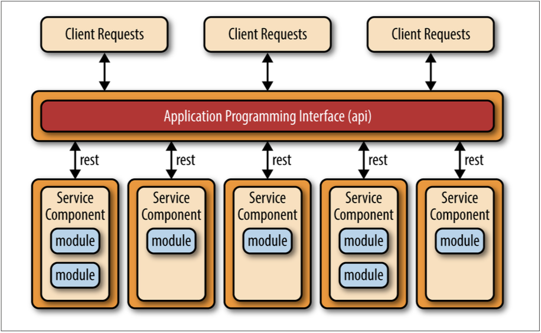
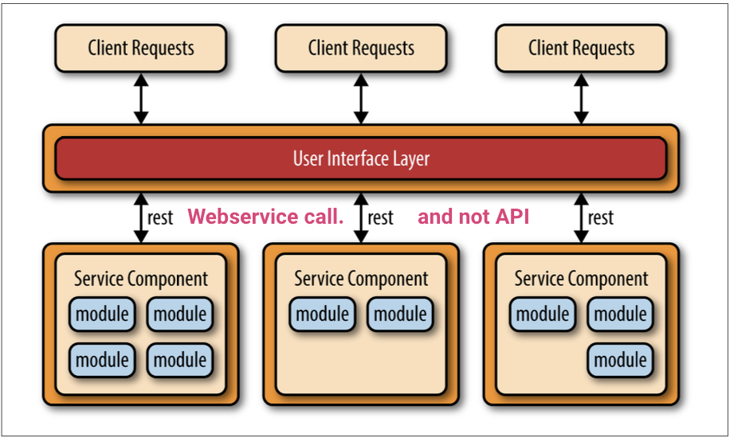
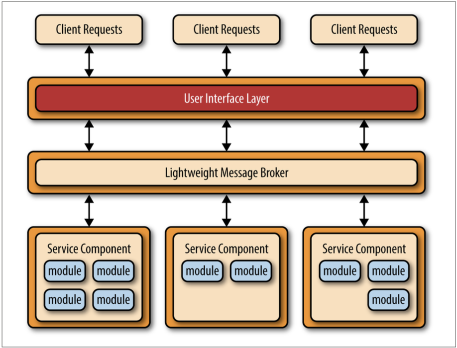
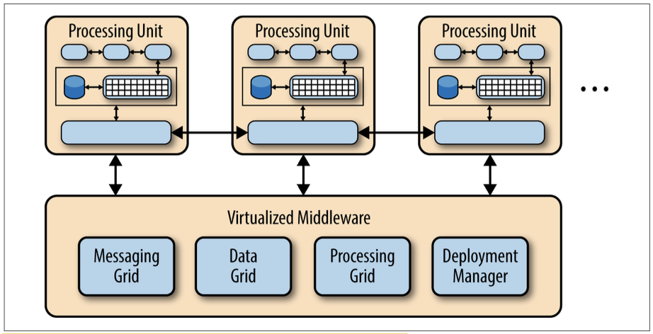
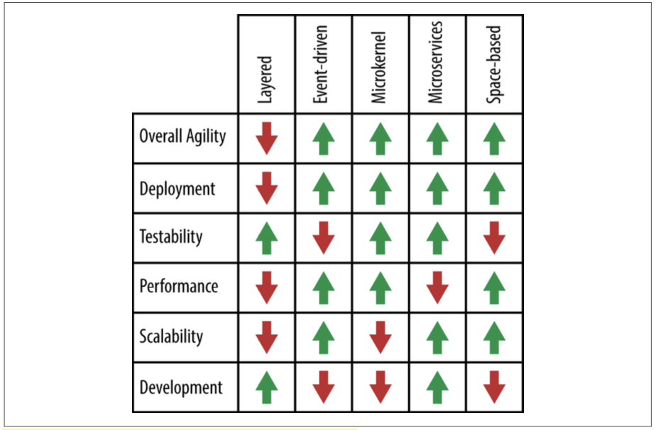

# Patterns - Mark Richards

## Event Driven Architecture
- Highly decoupled and distributed
- Not suited for transactional enviroments
- **Mediator Topology:** some level of orchestration

	- Components
		-  event queues
		- an event mediator
		- event channels
			- event message
			- event topic: topic based allocation
		- event processors
			- fine-grained/coarse-grained
			- should perform a single business task.
- **Broker Topology:** message flow is distributed across the event processor components in a chain-like fashion.


	- no central event mediator
	- much simpler & lightweight
	- Component: event processor
		- centralized
		- federated 

## Microkernel


- Is widely used in Linux OS.
- Components
	- Core system
	- Plug-in module
- Low scalibility
- Hard development

## Microservice
```
Monolitic problems:
- BigBang (all of it should be ready to be usable)
- No reusablility

SOA problems:
- Coarse granularity
- Orchestration is needed
```
- Separately deployed units
- Completly decoupled services
- It is distributed
- Low performace: Interoperability goes UP = Performance goes DOWN
- Topologies
	- **API REST-based:** Services are lightweight & have fine granularity.
	
	
	- **Application REST-based:** Services aren't lightweight & have coarse granularity.
	
	
	- **Centralized messaging**
	
	
## Space-based (Cloud-based)


- Removes the central database constraint and using replicated in-memory data grids.
- Components:
	- Processing unit
	- Virtualized middleware
		- Messaging grid: routes requests to processing units based on load/topic
		- Data Grid: syncronization of in-memory data grids of processing units.
		- Processing Grid: is optional. cordination between processing units when each one should handle porsion of request.
		- Deployment Grid: starts/shutsdown processing units based on load.


## Pattern-analysis
