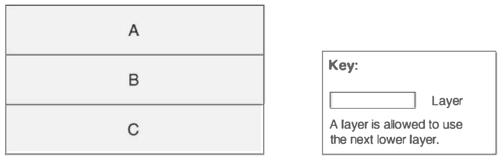
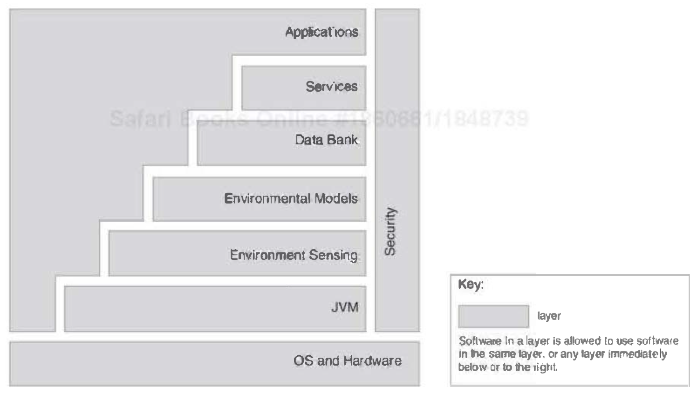
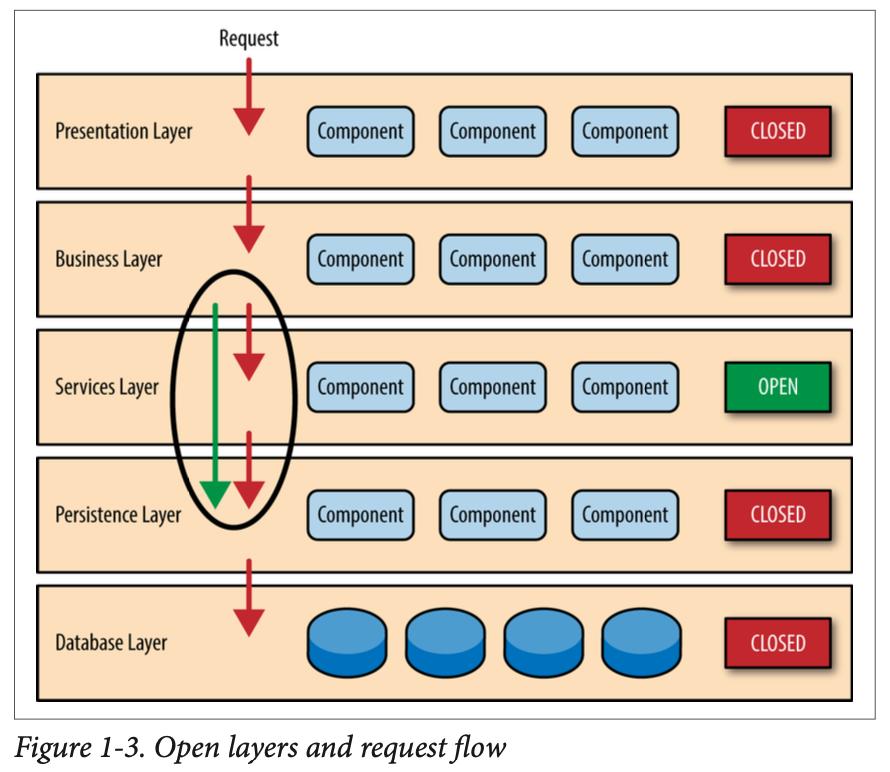
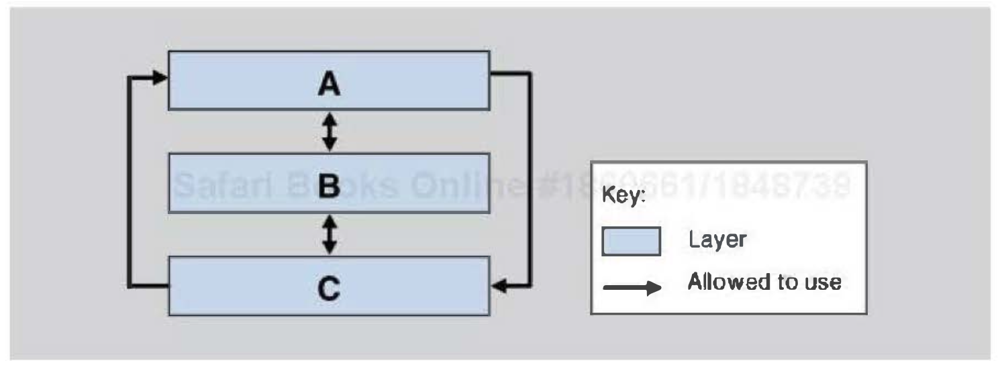
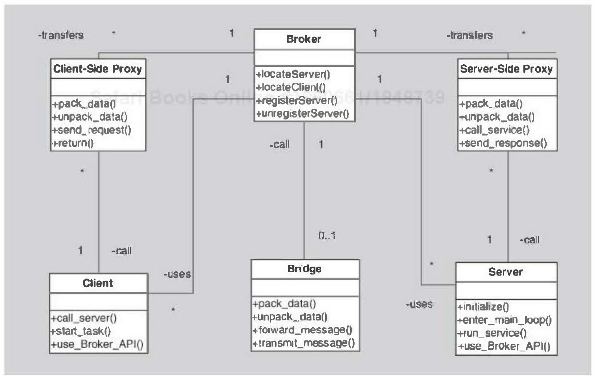
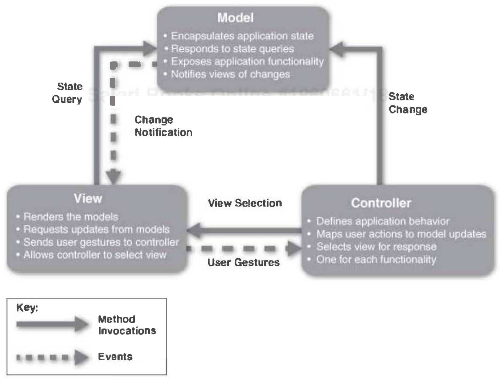

# Patterns
- Context, Problem, Solution

## Module patterns

### Layered
- Each layer serves the layer just above itself.

- Simple:

- With sidecar(sidebar):

- With open/closed jump flow

- Not a layered architecture (a wolf in layer clothing):

## Component & Conector patterns
### Broker Pattern

### MVC

### Pipe and filter
- Usable when we know the whole workflow
- Not good for interactive systems (it's static)

### Client-Server Pattern
- Server can be
	- performance bottleneck
	- single point of failure

### Peer-to-Peer Pattern
- Each component can be client or server at any time
- Weekness
	- security
	- data consistency
	- backup and recovery

### Service-Oriented Architecture Pattern (SOA)
- Elements
	- Service consumer
	- Service provider
	- Service registry: is a repository for services.
	- ESB
	- Orchestration
- Complex to build
- Performance overhead

### Publish-Subscribe Pattern
- List-based
- Broadcast-based
- Content-based

### Shared-Data Pattern
- data does not belong solely to any one of those components
- data accessors, shared-data store, synchronizer
- use of locks: SIX (shared, intent, exclusive)

## Allocation Patterns

### Map-Reduce Pattern
- need: quickly analyze enormous volumes of data
- efficiently perform a distributed and parallel sort of a large data set and provide a simple means
- key1: map function
- key2: used for sorting

### Multi-tier Pattern