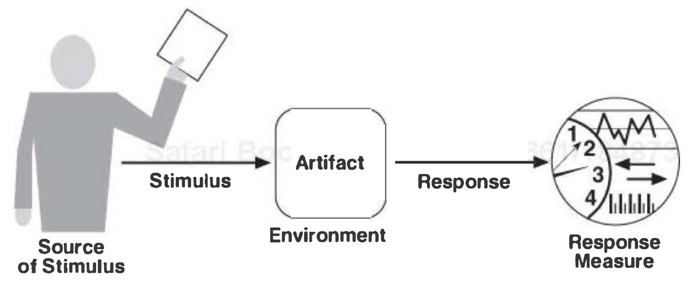
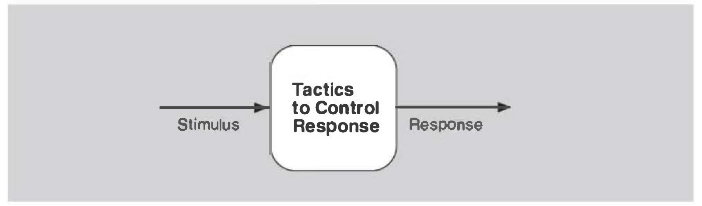

# Quality attribute base

## System Requirements
- **Functional**
- **Quality Attribute** (Non-functional)
- **Constraints:** Design decision that's already been made. (eg. realtime systems -> time)

## Quality Attribute Scenario

1. **Source of stimulus:** Is some entity.
	- A human
	- A computer system
	- Hardware
	- Software
	- Infrastructure
	- Environment
2. **Stimulus:** A condition that requires a response.
	- User operation -> Usability
	- Attack -> Security
	- Modification request -> Modifiability
	- A development phase completion -> Testability
3. **Environment** in which the scenario takes place.
	- Overload condition
	- Normal operation
	- Degraded operation
	- Startup/Shutdown
4. **Artifact:** The system to which the requirement applies.
	- A collection of systems
	- The whole system
	- Some piece(s) of system
5. **Response:** Stimulus mitigation activities.
	- By System (runtime qualities)
	- By Developer (development-time qualities)
6. **Response measure:** Response should be measurable in some fashion. to see if it was satisfactory. (whether the requirement is satisfied)
	- Latency/Throughput -> Performance
	- Uptime -> Availability
	- Labor/Wall clock time -> Modifiability

## Tactics

- Tactics are intended to control responses to stimuli.
- Tradeoffs must be explicitly considered and controlled by the designer.

## Categories of Quality Design Decisions
- A systematic categorization of these decisions.
- Are not the only way to classify architectural design decisions.
- Categories might overlap, but it's all right.

1. **Allocation of Responsibilities:** Includes functional decomposition & object modeling.
	- Identifying the important responsibilities.
		- basic system functions
		- architectural infrastructure
		- satisfaction of quality attributes
	- Allocation of those to non-runtime and runtime elements.

2. **Coordination Model:** Elements interact with each other through mechanisms.
	- What elements must/must not coordinate
	- Properties of coordination (timeliness, currency, etc.)
	- Communication mechanisms

3. **Data Model**
	- how the data items are created, initialized, accessed, persisted, manipulated, translated, and destroyed.
	- metadata needed for interpretation of the data.
	- relational database, collection of objects, or both.

4. **Management of Resources:** Hardware & Software.
	- Limits of resources that must be managed.
	- Which system element(s) manage resource.
	- How resources are shared.
	- Impact of saturation on different resources.

5. **Mapping among Architectural Elements**
	- modules -> runtime elements
	- runtime elements -> processors
	- items in the data model -> data stores
	- modules & runtime elements -> units of delivery

6. **Binding Time Decisions:** Scope, point in the life cycle, mechanism.
	- design time by a developer
	- runtime by an end-user
	- costs to implement
	- costs to make a modification

7. **Choice of Technology:** It becomes a constraint.
	- Which technologies are available?
	- Whether the available tools are adequate
	- Internal familiarity & external support
	- Side effects (constraints)
	- Compatibility with the existing tech stack
