# Quality attributes
1. Availability
2. lnteroperability
3. Modifiability
4. Performance
5. Security
6. Testability
7. Usability
8. Variability
9. Portability
10. Development Distributability
11. Scalability
12. Deployability
13. Mobility
14. Monitorability
15. Safety
16. Marketability

## Availibility
- MTBF / (MTBF + MTTR)

### General Scenario
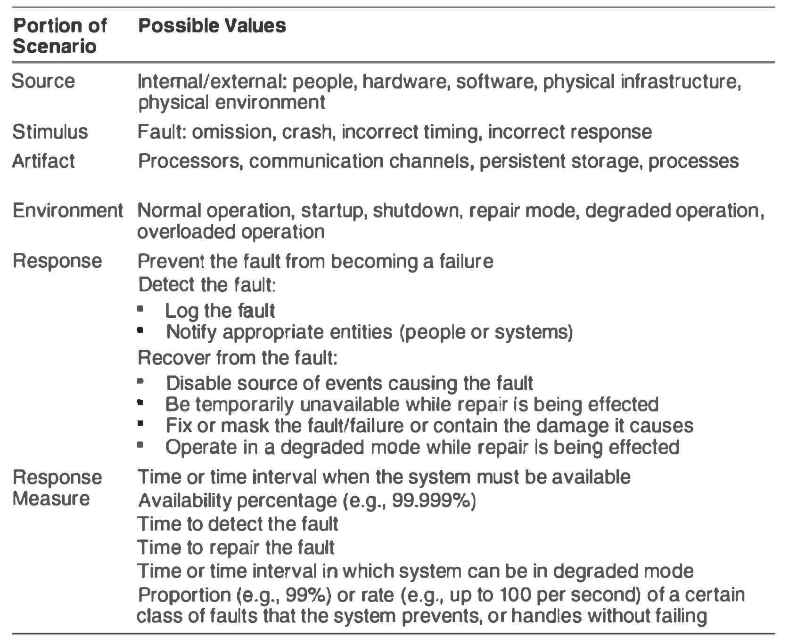

### Tactics
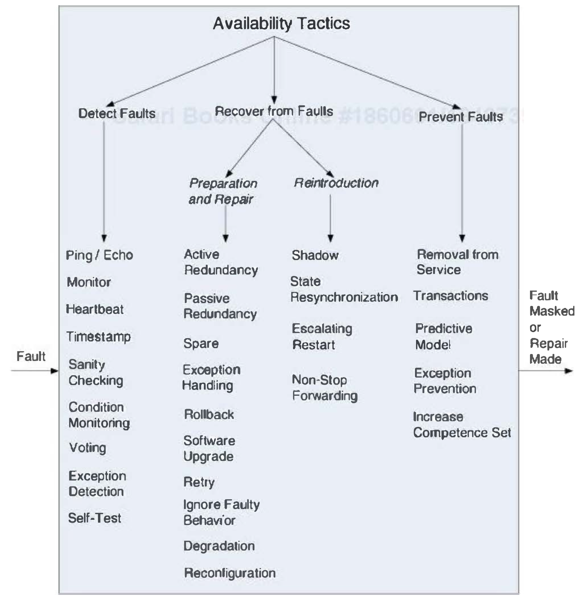

### Design checklist
*TODO*

## Interoperability
- Exchange meaningful information
- More meaningfulness > More header > Heavy packet > Less exchange rate vs. High exchange rate — Tradeoff
- System of systems(SoS): A group of systems that are interoperating to achieve a joint purpose.
	- Directed: Strict Centralized management
	- Acknowledged: Centralized management + self-management.
	- Collaborative: Systems voluntarily work tog.ether
	- Virtual: Systems don't know about each other
- SOAP vs REST: Simple Object Access Protocol / Representation State Transfer

### General Scenario
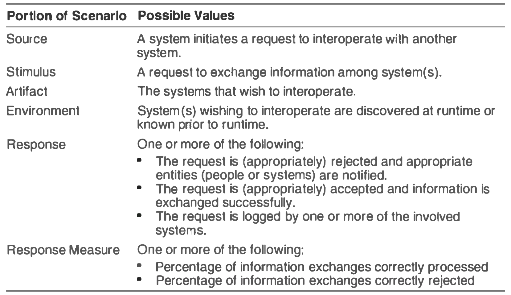

### Tactics
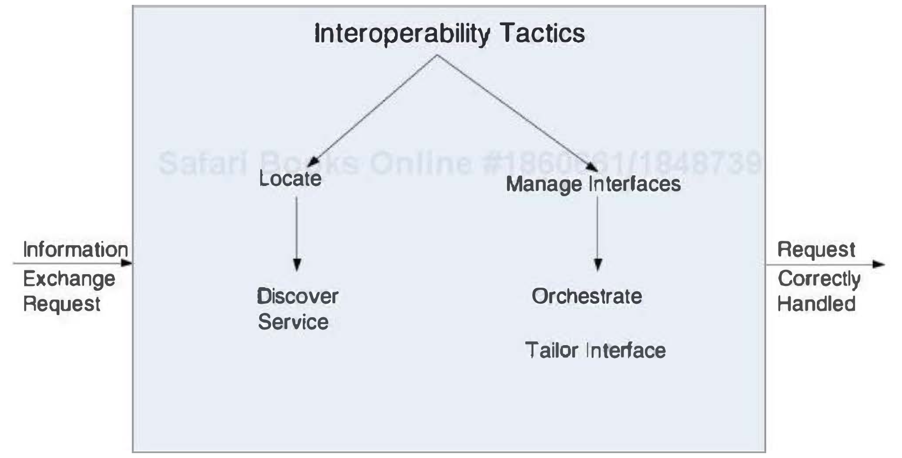

- Locate
	- Discover service: Service registry
- Manage Interfaces
	- Orchestrate: Uses a control mechanism. Is used when systems have complex interacts & complex tasks. Workflow engines/mediator design pattern/language such as BPEL.
	- Tailor interface: adds or removes capabilities to an interface. decorator pattern

### Design checklist
*TODO*

## Modifiability

### General Scenario
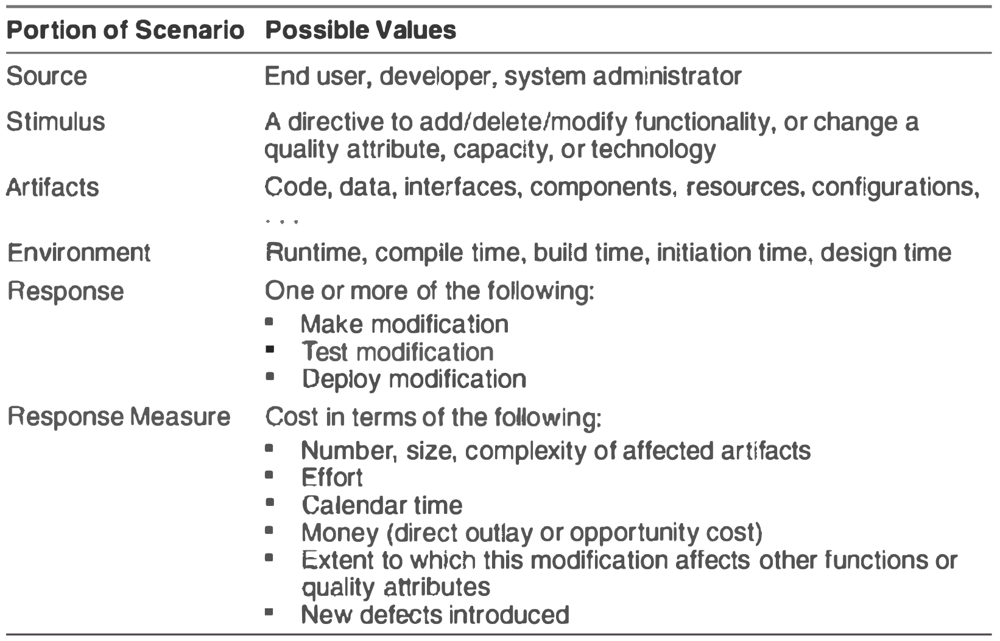

### Tactics
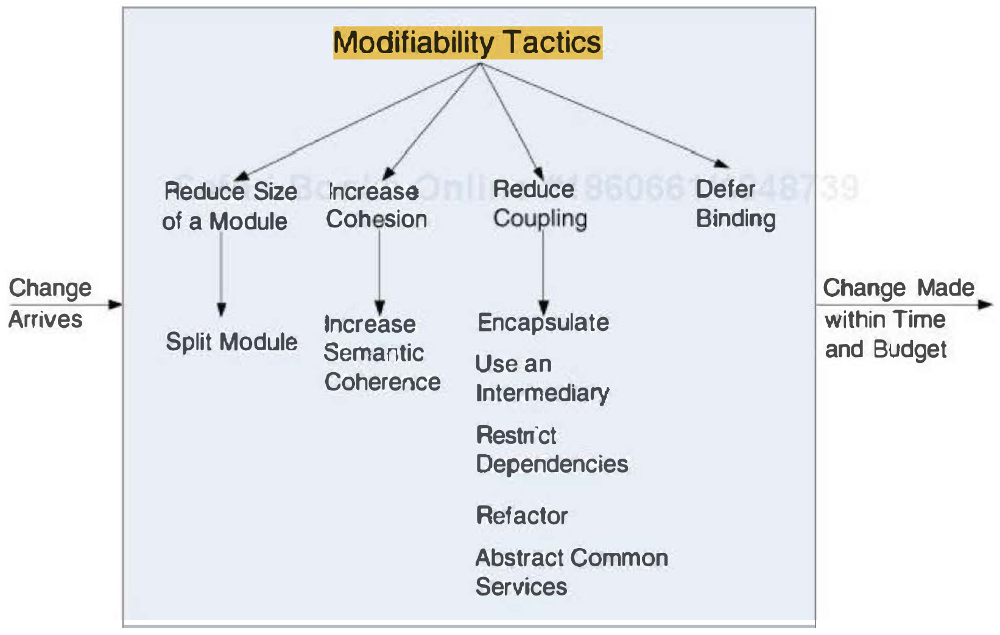

### Design checklist
*TODO*

## Performace
- throughput (speed)
- efficiency (utilization)

### General Scenario
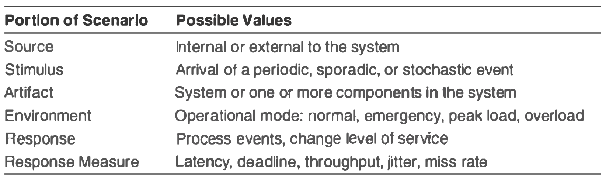

### Tactics
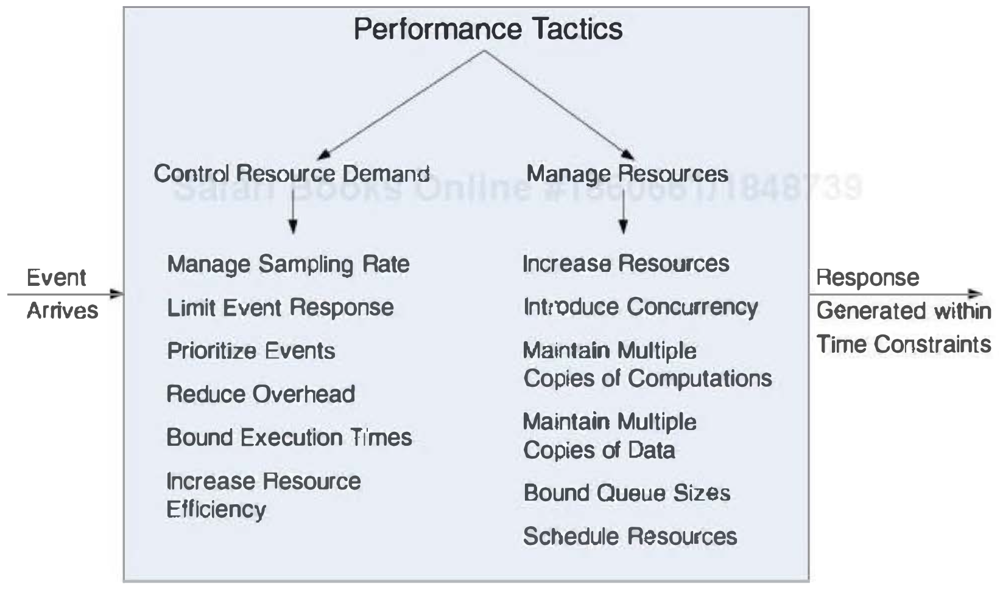

### Design checklist
*TODO*

## Security
- Prevent data and info from unauthorized access.
- Provide access to authorized system and people.
- CIA
	- Confidentiality
	- Integrity
	- Acailability

### General Scenario
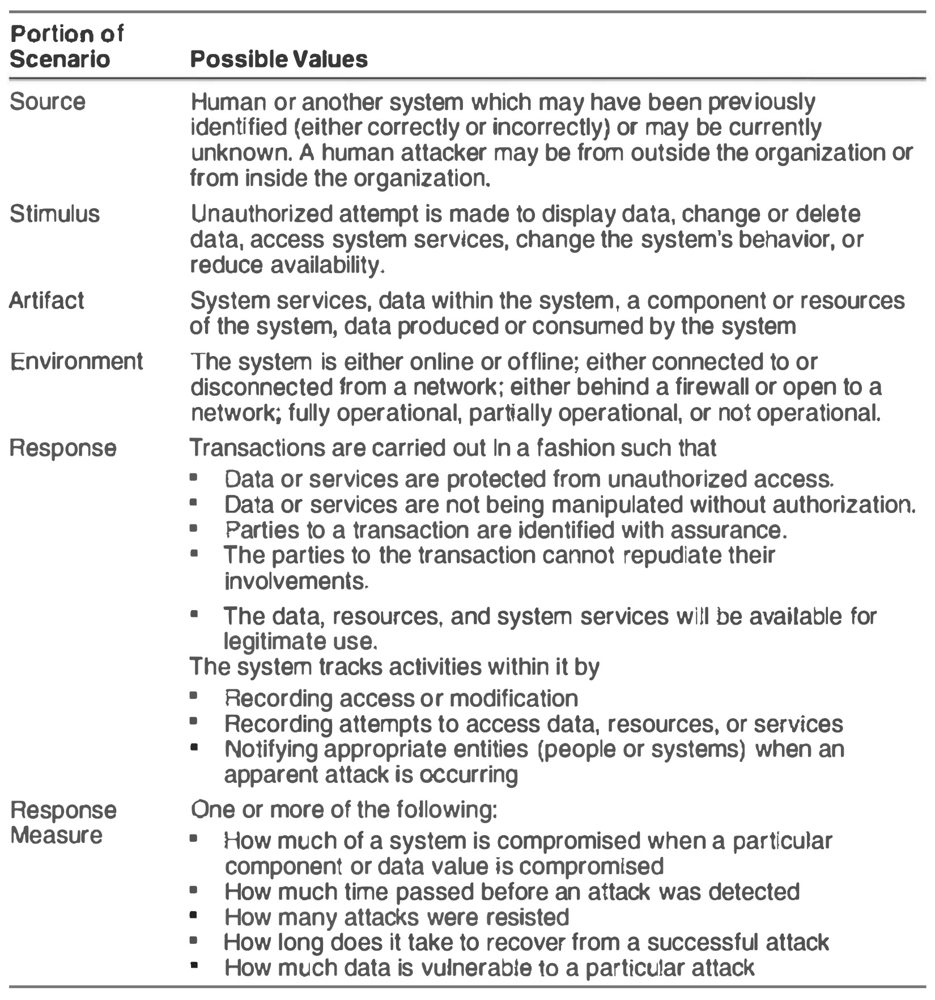

### Tactics
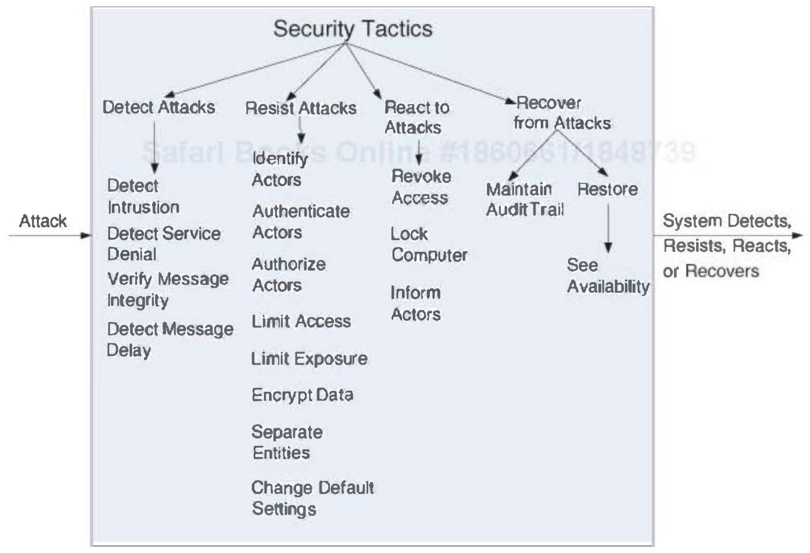

### Design checklist
*TODO*

## Testability
- 30/50% of the cost of developing well-engineered systems.
- Testable if it "gives up" its faults easily

### General Scenario
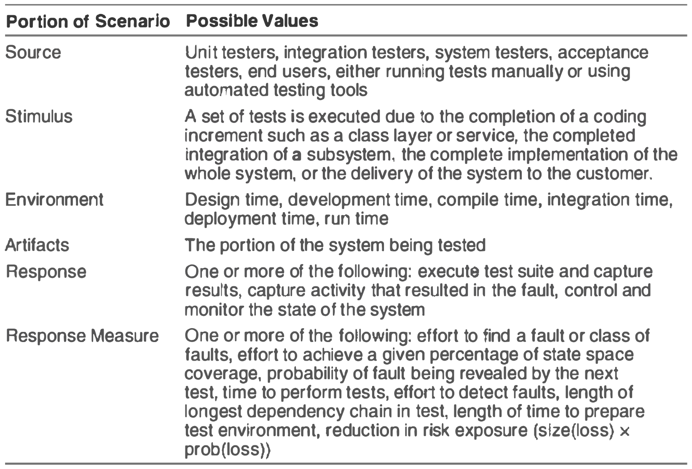

### Tactics
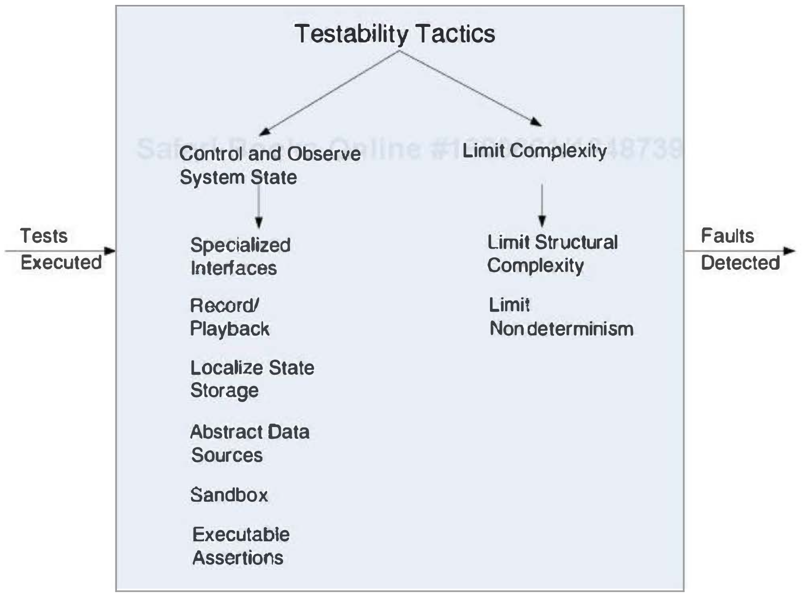

### Design checklist
*TODO*

## Usability
- How easy the user accomplish a desired task
- Learning system features: fast learning curve
- Using a system efficiently
- Minimizing the impact of [user] errors
- Adapting the system to user needs
- Increasing confidence and satisfaction

### General Scenario
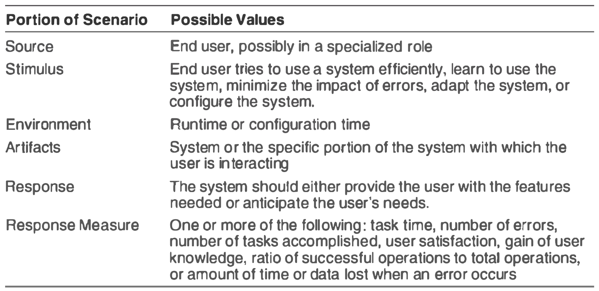

### Tactics
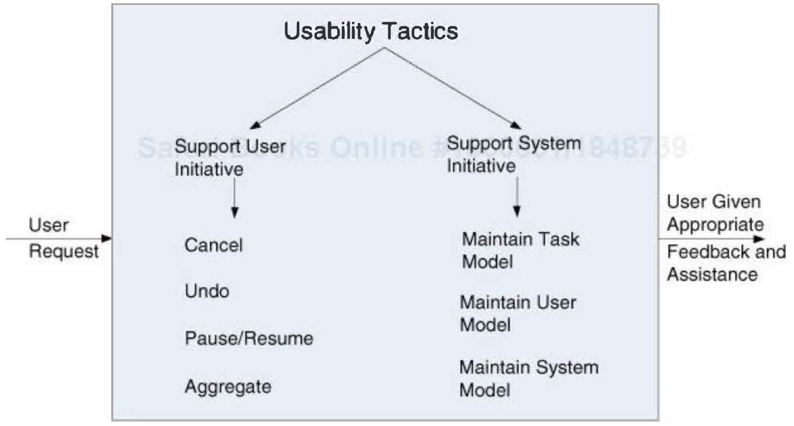

### Design checklist
*TODO*
